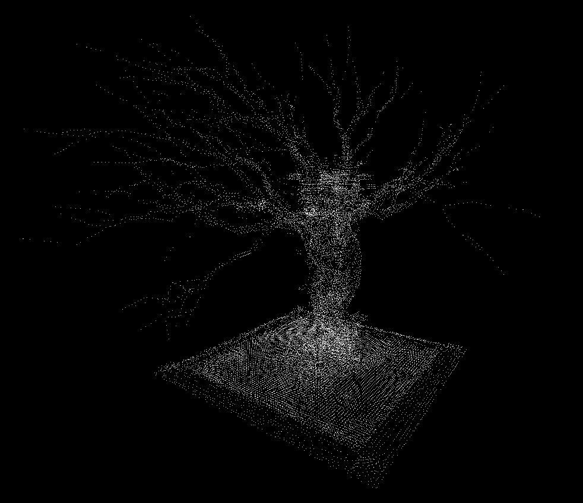

# Tianshi

A particle effects demo inspired by the Endfield homepage.

[](https://sieluna.github.io/Tianshi)

*Click the image to view [live demo](https://sieluna.github.io/Tianshi).*

## Quick Start

### Build
```bash
# Native platform
cargo build --release

# WASM
trunk build --release --cargo-profile wasm-release
```

### Run
```bash
cargo run
```

## Controls

| Action | Input |
|--------|-------|
| Switch Model | Mouse Scroll / `Q` |
| Rotate Camera | Right Mouse Drag |
| Rotate Model | Left Mouse Drag |
| Move (WASD) | `W`/`A`/`S`/`D` |
| Move Up/Down | `Space` / `Left Ctrl` |

